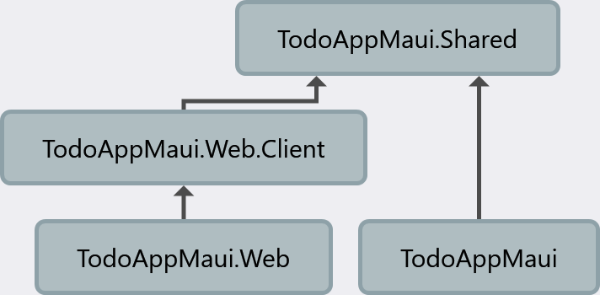
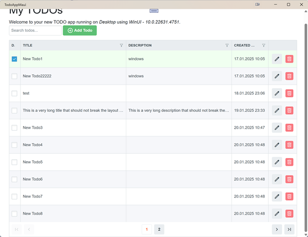
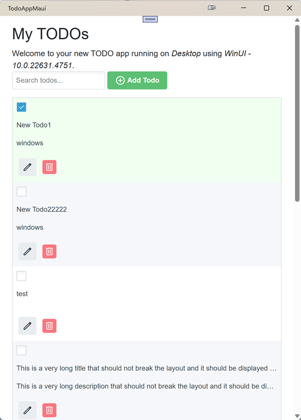

# TodoApp Maui: A Cross-Platform Blazor .NET 9.0 Demo

So, we looked at a ToDo app built using the new .NET MAUI Blazor .NET 9 project template. This app shows how to make one app work on many different devices - Windows, Android, iOS, and even in a web browser. It's like a practice project to see how to make a multi-platform app using .NET MAUI and Blazor. We also use a special service to handle the work, so the same logic can be used everywhere.

## Project Structure - How it is Organized

The project has two main parts:

1.  **`TodoAppMaui.sln`**: This is the main app project. It makes the Blazor components show up on different platforms.

2.  **`TodoAppMaui.Shared.Tests.sln`**: This part has the tests for the Blazor component. They make sure the app works correctly.

> Note: Please let me know if you know an easy way to add a test project to the MAUI solution for only one platform. This has led to two different projects as I only need to test targeting .NET 9.

### Looking Inside `TodoAppMaui.sln`

The `TodoAppMaui.sln` project is set up to keep things organized.

Here’s a quick look at each part:

-   **`TodoAppMaui`** (Main App):
    *   This is the main UI shell of the app.
    *   It uses Blazor for the UI.
    *   It has resources for web, Android, iOS, and Windows.
    *   `MauiProgram.cs` is the starting point of the app and sets up the MAUI app.
    *   All UI parts are in the `.Shared` project. Only platform dependent services are there.
      *   **`FormFactor.cs`**: This file finds out which platform the app is running on.
      *   **`TodoService.cs`**: We have the two `TodoService' implementations for our Todo application.

-   **`TodoAppMaui.Shared`**:
    *   This has the code that works on all platforms, like the business logic, UI and models.
    *   You'll find models like `ToDoItem.cs` here.
    *   It also contains the `MainLayout.razor`, navigation `NavMenu.razor` and components like `ToDoList.razor`
    *   It has folders for `Pages`, `Components`, and `Services`.
        *   **`ITodoService.cs`**: This defines how the ToDo service should work. It's used by the Blazor components.

-   **`TodoAppMaui.Web`**:
   *   This project is the *server-side* part of the Blazor Web App. It uses the shared code and has its own `program.cs` file.
    *   It handles server operations and is the starting point for the web application.
    *   **Why do we need this?** This is the project that runs the Blazor Web App on the server.
-   **`TodoAppMaui.Web.Client`**:
   *  This project is the *client-side* part of the Blazor Web App. It also has its own `program.cs` file.
    *   It contains the Blazor code that runs in the browser.
    *   **Why do we need this?** This is where the UI elements are loaded for the Blazor web app, and this code runs on the user’s computer (in the browser).
### Architecture - How it all fits together



-   **`TodoAppMaui.Shared`** is the base for `TodoAppMaui` and `TodoAppMaui.Web.Client`.
-   **`TodoAppMaui`** is the main MAUI project.
-   **`TodoAppMaui.Web.Client`** reference all Blazor components from `TodoAppMaui.Shared`.
-   **`TodoAppMaui.Web`** is the main server side application that is hosting our web application.

## The `ITodoService` - The Brain of the Operation

The `ITodoService` interface is in the `Services` folder inside `TodoAppMaui.Shared` as it must accesible from all places.

The `ITodoService.cs` file decrlare the methods for:
-   Adding new ToDo items.
-   Getting the list of ToDo items.
-   Changing ToDo items.
-   Deleting ToDo items.
-   And other logic.

This service is shared across all platforms, so it keeps the core logic of the app the same everywhere.

## Getting Started

Here's how to get started with this project:

### Prerequisites

*   **[.NET SDK 9.0](https://dotnet.microsoft.com/en-us/download/dotnet/9.0)**  (or higher)
*   **Visual Studio 2022** (or Visual Studio Code with the .NET C# extensions) with **MAUI workloads installed**.
    *   If using Visual Studio, ensure you have the following workloads installed: ".NET MAUI development", "ASP.NET and web development"
    *   If using VS Code, ensure you have the following extensions installed: "C# Dev Kit" and the MAUI extension if you are using the UI to deploy
*   **For Android Deployment:** Android SDK and emulator/physical device setup.
*   **For iOS Deployment:** macOS with Xcode and a simulator/physical device setup.

### Steps

1.  **Clone the Repository:**
    ```bash
    git clone [repository-url]
    cd TodoAppMaui
    ```
2.  Open the `TodoAppMaui.sln` file in Visual Studio (or another IDE).
3. **Run the Application:**
    *   **Web:**
        1.  In Visual Studio, right-click on `TodoAppMaui.Web` and select `Set as Startup Project`.
        2.  Press `F5` or click on `Run`.
        3.  Your application will open in a web browser.
    *   **Windows:**
        1.  In Visual Studio, right-click on `TodoAppMaui` and select `Set as Startup Project`.
        2. Select windows target from dropdown above and press `F5` or click on `Run`.
        3. Your application will run as a native desktop application.
    *   **Android:**
        1.  In Visual Studio, right-click on `TodoAppMaui` and select `Set as Startup Project`.
        2. Select Android target from dropdown above and press `F5` or click on `Run`.
        3.  Choose your desired emulator or physical device and the application will be deployed and run there.
4.  **Run the Tests:**
    *   **Visual Studio:**
        1. Open solution  `TodoAppMaui.Tests`
        2.  In the Test Explorer, select class `ToDoListTests`  and click `Run all`.


## Platform-Specific Implementations

Instead of using one `TodoService.cs` file, we will create different implementations for each platform. This helps us:

-   Use special APIs for each platform, like local storage or databases.
-   Make the app behave differently based on the platform.
-   Keep the core logic consistent but allow each project to have its own specific needs.

**Where to find the implementations:**

*   **`TodoAppMaui` (MAUI App):** `Services/TodoService.cs`. Use special API for Windows/Android.
*   **`TodoAppMaui.Web`:** `Services/ToDoServiceServer.cs` Can the `ITodoService` be implemented using something web specific. We do not use anything as it is only used for pre-rendering now.
*   **`TodoAppMaui.Web.Client`:** `Services/TodoServiceClient.cs` Use storage, http or things that work for client.

## Dependency Injection - Connecting the Parts

To use the correct `ITodoService` for each platform, we use dependency injection. We set this up in `MauiProgram.cs` or `Program.cs` files.

*   **MAUI App:** In `MauiProgram.cs`, register `TodoService` (depending from platform settings: Windows or Android) as `ITodoService`.
*   **Web App:** In `Program.cs` of `TodoAppMaui.Web`, register `TodoServiceServer` as `ITodoService`.
*   **Web Client:** In `Program.cs` of `TodoAppMaui.Web.Client`, register `TodoServiceClient` as `ITodoService`.

This way, each component gets the right implementation of `ITodoService` for its platform.


# Test solution - Making Sure It Works

This project also has tests to make sure the app works well. It has two main parts:

## `TodoAppMaui.Shared`

This has all the shared code and UI parts of the app. It's made to be reused across platforms.

### Structure:

-   **`Dependencies`**: Where we manage the project's needed packages.
-   **`wwwroot`**: Has the web assets.
-   **`Components`**: Has the reusable UI components.
    -  **`ToDoList.razor`**: A blazor component for ToDo list using Radzen library
-   **`Layout`**: Holds layout classes.
-   **`Models`**: Has the data models used in the app.
-   **`Pages`**: Has the UI pages.
-   **`Services`**: Has the services for data access, logic, etc.
    -  **`IToDoServices.cs`**: Definition for the ToDo related services.

## `TodoAppMaui.Shared.Tests`

This is where we write tests for the `TodoAppMaui.Shared` project. It makes sure the logic is reliable.
More about bUnit testing can be found [here](https://github.com/AlexNek/Blazor-for-You/blob/master/bUnit/readme.md)

### Structure:

-   **`Dependencies`**: Where the test dependencies are managed.
-   **`SharedDataTests.cs`**: Tests for the shared data logic. Simple example how test could run wrong. Try running all tests or one at a time with and without the static keyword `private static int _sharedData;`. 

-   **`ToDoDataTest.cs`**: Tests for the ToDo data logic.

## Project Connection

`TodoAppMaui.Shared.Tests` needs to use code from `TodoAppMaui.Shared`, so it can test if everything works correctly.

The unit tests are for the `ToDoList` component, and they are located in the `ToDoListTests` class.

**Test List**

Here’s what each test does:

1.  `AddToDo_ShouldCreateNewItemSuccessfully`: Checks if adding a todo creates and saves a new item.
2.  `AddToDo_ShouldCreateNewToDoSuccessfully`: Tests if a new "To Do" object is created.
3.  `AddToDo_ShouldEnableAddButtonWithValidInput`: Checks if the "add" button only works when the input is okay.
4.  `AddToDo_ShouldEnableAddButtonAfterCancel`: Checks if the button works after a user cancels adding.
5.  `AddToDo_ShouldEnableAddButtonAfterCheck`: Checks if the button works when an item is checked as completed.
6.  `Component_ShouldDisplayTodos_WhenLoaded`: Checks if todos are shown when the component starts.
7.  `Component_ShouldRenderSuccessfully`: Checks if the component loads without errors.
8.  `DeleteToDo_ShouldDeleteToDoSuccessfully`: Checks if deleting a todo works.
9. `Search_ShouldFilterTodos_Correctly(3 Tests)`: Checks if searching works.
10. `SetToDo_ShouldUpdateToDoSuccessfully`: Checks if updating a todo works.
11. `ShouldDisplayEmptyList`: Checks if the correct empty list message is shown when there are no todos.
12. `ShouldHandleBindingTitleAndDescriptions`: Checks how the UI shows the title and descriptions.
13. `ShouldLoadTodos_Successfully`: Checks if the todos load correctly.
14. `ShouldPaginateCorrectly`: Checks if the pagination works.

**Skipped Tests**

*   `ShouldHandleBindingTitleAndDescriptions(Ignore)`: This test is skipped because it depends on how the UI looks.


To make finding UI elements easier, we use special attributes, such as `data-testid`.

```razor
        <RadzenTextBox Placeholder="Search todos..."
                       @oninput="@(args => OnSearch(args.Value.ToString()))"
                       data-testid="search-todo-input" />
```

Then in tests we find elements using:
```csharp
            var addButton = cut.Find("[data-testid='add-todo-button']");
```

# The To-Do App - What It Does

## Overview

This is a basic Blazor component for managing to-do lists. You can add, edit, delete, and search tasks.

Desktop screen size:  


Smartphone screen size:  



## Features

-   **View ToDos:** Shows todos in a list, you can go through different pages of items.
-   **Add ToDos:** You can add new items using a text field and a button.
-   **Edit ToDos:** You can change existing to-do items.
-   **Delete ToDos:** You can remove items from the list.
-   **Search ToDos:** You can search for items using text and the list is filtered dynamically.

The layout adjusts to different screen sizes and orientations.

# How to Make Services Work

Each platform needs its own special service setup:

-   **Web:** It needs two services. One for `TodoAppMaui.Web` (does nothing) and another for `TodoAppMaui.Web.Client` using `LocalStorageService` from Blazored.LocalStorage.
-   **Windows:** In `TodoAppMaui\Platforms\Windows\`, we save files in the Local Application Data folder.
-   **Android:** In `TodoAppMaui\Platforms\Android`, we save files in the AppData directory.
-   **iOS:** Not implemented yet.

Register services using code like this in `MauiProgram.cs`:

```csharp
using TodoAppMaui.Shared.Services;

#if ANDROID
using TodoAppMaui.Platforms.Android;
#endif

#if WINDOWS
using TodoAppMaui.Platforms.Windows;
#endif
...
            builder.Services.AddSingleton<IToDoService, ToDoService>();

```

## Conclusion

This project is a great example of how to build an app that works on many different platforms using .NET MAUI and Blazor. It shows how to organize code, create reusable components, and make sure the app works well through testing. This guide will help you to start working with the project, and create the best app for you!
